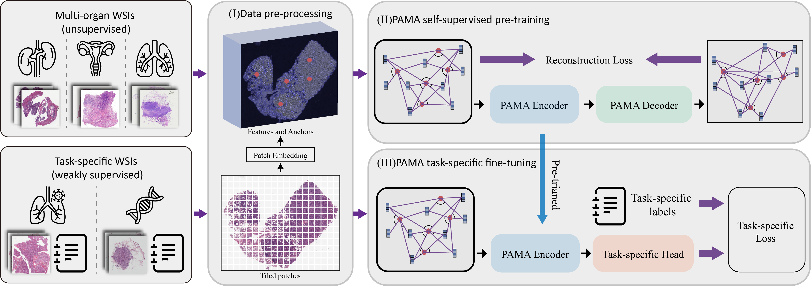
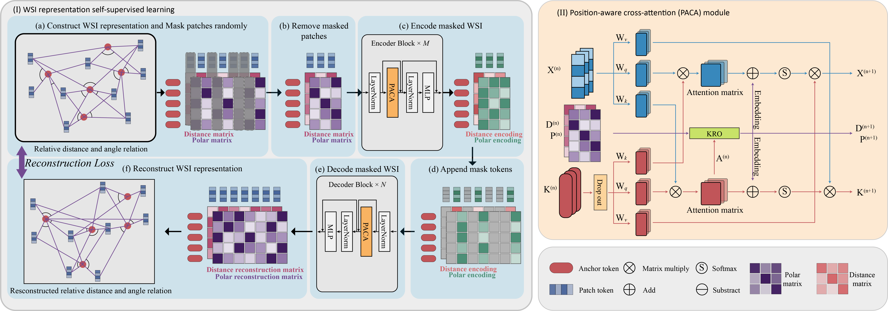

# PAMA
## Pan-cancer Histopathology WSI Pre-training with Position-aware Masked Autoencoder

Kun Wu, Zhiguo Jiang, Kunming Tang, Jun Shi, Fengying Xie, Wei Wang, Haibo Wu, and Yushan Zheng


## 📢 News

### Oct 2024
- **Upload pre-trianing file in Hugging Face**: We have uploaded multi-organ pre-training checkpoint in [Hugging Face](
https://huggingface.co/wkeen/pama/tree/main).

### July 2024
- **The extended version release**: We have extended [PAMA](
https://doi.org/10.48550/arXiv.2407.07504) for pan-cancer analysis.

### May 2023
- **The conference paper release**: The [PAMA paper](https://doi.org/10.1007/978-3-031-43987-2_69) has been accepted for *MICCAI 2023*.


## Multi-organ pre-training strategy overview

<p align="center">
     <br>

  *Overview of multi-organ pre-training with PAMA*

</p>

## Framework Overview

<p align="center">
     <br>

  *Overview of PAMA architecture*

</p>


### Patch feature extract

The directory structure of WSI datasets:
```
PATH_to_datasets
├─slide_1
│  ├─overview.jpg
│  │
│  ├─Medium(20x)
│  │      ├─patch_1.jpg
│  │      ├─patch_2.jpg
│  │      ├─.......
│  │      └─patch_pm1.jpg
│  │  
│  ├─Overview(5x)
│  │      ├─patch_1.jpg
│  │      ├─patch_2.jpg
│  │      ├─.......
│  │      └─patch_po1.jpg
│  │
│  └─Small(10x)
│         ├─patch_1.jpg
│         ├─patch_2.jpg
│         ├─.......
│         └─patch_ps1.jpg
├─slide_2
│  ├─overview.jpg
│  │
│  ├─Medium(20x)
│  │      ├─patch_1.jpg
│  │      ├─patch_2.jpg
│  │      ├─.......
│  │      └─patch_pm2.jpg
│  │  
│  ├─Overview(5x)
│  │      ├─patch_1.jpg
│  │      ├─patch_2.jpg
│  │      ├─.......
│  │      └─patch_po2.jpg
│  │
│  └─Small(10x)
│         ├─patch_1.jpg
│         ├─patch_2.jpg
│         ├─.......
│         └─patch_ps2.jpg
│
└......
```

Extract patch features under 20× magnification and construct the WSI feature:
```
#!/bin/bash

#SBATCH -w gpu0[1]
#SBATCH --gres=gpu:1
#SBATCH -N 1
#SBATCH -p com
#SBATCH --cpus-per-task=24
#SBATCH -o dino_extract.log

source activate my_base
srun python ./extract_patch/extract_dino.py \
  --dist-url 'tcp://localhost:10001' \
  --multiprocessing-distributed \
  --mask-level 3 \
  --image-level 1 \
  --arch vit_small \
  --use_fp16 False \
  --batch_size_per_gpu 512 \
  --avgpool_patchtokens False \
  --n_last_blocks 1 \
  --checkpoint_key teacher \
  --pretrained_weights PATH/dino_pretrained.pth \
  --data_path './data/train.csv' \
  --save-dir ./dino_WSI_features/ \
  --error-txt ./dino_WSI_features/log/error.txt \
  /PATH_to_datasets
```


### Pre-train

Run the codes on the slurm with multiple GPUs:
```
#!/bin/bash

#SBATCH -w gpu0[1]
#SBATCH --gres=gpu:2
#SBATCH -N 1
#SBATCH -p com
#SBATCH --cpus-per-task=40
#SBATCH -o tcgaLung_pama_pretrain.log

srun python ./main_pretrain.py \
  --dist-url 'tcp://localhost:10001' \
  --b 18 \
  --train './data/train.csv' \
  --mask_ratio 0.75 \
  --in-chans 384 \
  --lr 1e-3 \
  --epochs 100 \
  --multiprocessing-distributed \
  --save-path ./checkpoints/tcgaLung_pama_pretrain \
  /dino_WSI_features

```

### Fine-tuning and linear-probing

Run on on multiple GPUs:
```
#!/bin/bash

#SBATCH -w gpu0[1]
#SBATCH --gres=gpu:2
#SBATCH -N 1
#SBATCH -p com
#SBATCH --cpus-per-task=24
#SBATCH -o tcgaLung_pama_finetune.log

source activate my_base
srun python ./main_finetune.py \
  --dist-url 'tcp://localhost:10001' \
  --b 12 \
  --train './data/train.csv' \
  --test './data/test.csv' \
  --finetune "./checkpoints/multi_organ_pretrain.pth.tar" \
  --in-chans 384 \
  --lr 1e-3 \
  --epochs 30 \
  --num-classes 3 \
  --weighted-sample \
  --multiprocessing-distributed \
  --save-path ./tcgaLung_pama_finetune/ \
  /dino_WSI_features
```

```
#!/bin/bash

#SBATCH -w gpu0[1]
#SBATCH --gres=gpu:2
#SBATCH -N 1
#SBATCH -p com
#SBATCH --cpus-per-task=24
#SBATCH -o tcgaLung_pama_linear.log

source activate my_base
srun python ./main_linprobe.py \
  --dist-url 'tcp://localhost:10001' \
  --b 12 \
  --train './data/train.csv' \
  --test './data/test.csv' \
  --finetune "./checkpoints/multi_organ_pretrain.pth.tar" \
  --in-chans 384 \
  --lr 1e-3 \
  --epochs 30 \
  --num-classes 3 \
  --weighted-sample \
  --multiprocessing-distributed \
  --save-path ./tcgaLung_pama_linear/ \
  /dino_WSI_features
```


If the code is helpful to your research, please cite:
```bibtex
@InProceedings{10.1007/978-3-031-43987-2_69,
author="Wu, Kun 
and Zheng, Yushan
and Shi, Jun
and Xie, Fengying
and Jiang, Zhiguo",
title="Position-Aware Masked Autoencoder for Histopathology WSI Representation Learning",
booktitle="Medical Image Computing and Computer Assisted Intervention -- MICCAI 2023",
year="2023",
publisher="Springer Nature Switzerland",
address="Cham",
pages="714--724",
isbn="978-3-031-43987-2"
}
```